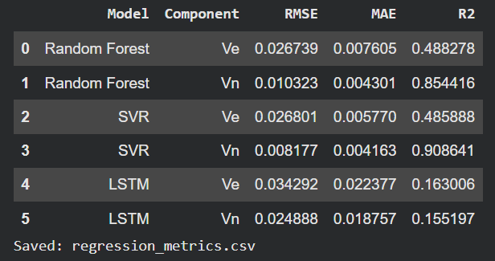
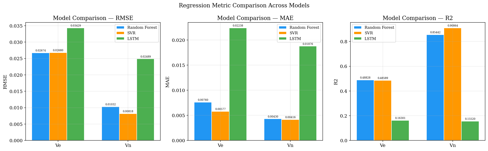
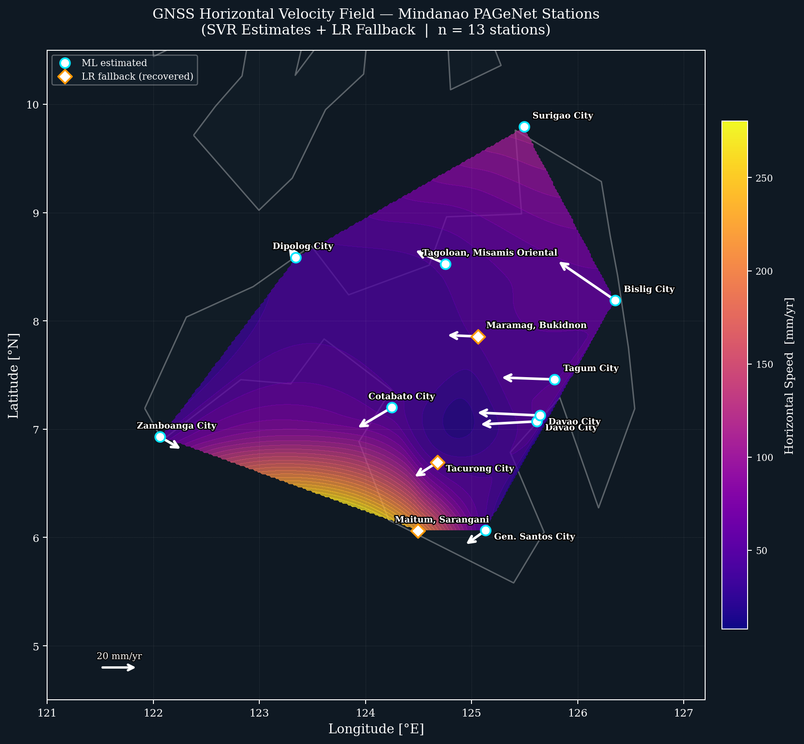
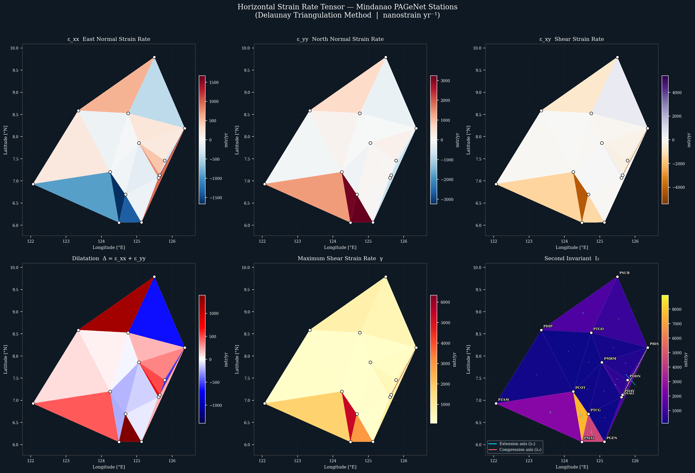

"MACHINE LEARNING FOR GNSS VELOCITY PREDICTION OF CRUSTAL GROUND DEFORMATION AND STRAIN ANALYSIS IN MINDANAO" 
using 3 models (Random Forest, Support Vector Regression, Long Short-Term Memory)

Regression Metrics

Model Comparison Bar Graph

Velocity Field Mapping

Strain Analysis Mapping

Just DL the notebook file and run in your colab/local IDE

"DRAFT STORAGE FOR THE ML CODE OF THIS THESIS
CANT LOCALIZE THIS YET COZ COLAB GPU IS MUCH BETTER THAN MINE"

TODO: PRACTISAN KO NLNG NI, DITSOHAN NAKO BUHAT EXTENSION/STREAMLIT MWHEEHE